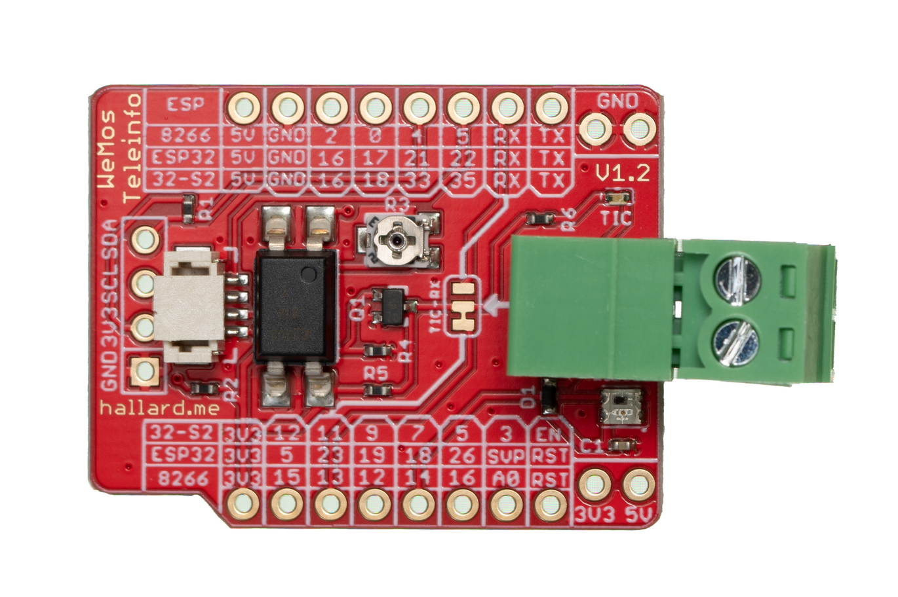
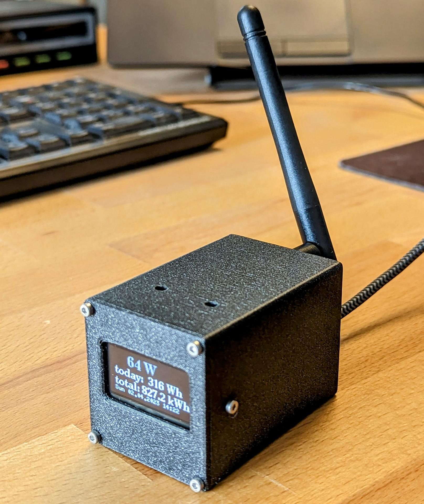

# home-assistant-linky-solar
This repository contains averything I have done to be able to read out my Linky meter (French) and, based on that reading take care that I don't export the generated electricity from my solar panels.

# Read electricity consumption from your Linky meter

## What you need:

### Wemos TeleInfo

The TeleInfo device is a small print that is soldered on an ESP32 mini print. The device is then connected to your Linky kWh meter that is used in France. To get this system working, you have to flash the ESP32 with ESPHome software, that is provided by a Home-Assistant instance. To read all necessary data, use the esphome-linky.yaml file that I have made [esphome-linky.yaml](./esphome-linky.yaml)

https://www.tindie.com/products/hallard/wemos-teleinfo/

In this way it is possible to read your electricity consumption in Home Assistant. Also it is possible to get notion of _heures_ _pleines_ 
and _heures_ _creuses_. Using this info, it is possible to switch devices on or off depending on the hours of cheap electricity. For instance your water heater can be controlled by this.

### OpenDTU

The OpenDTU device is a way of communication between a HoyMiles inverter and your Home Assistant instance. Also the display shows the current power output of your inverter.

https://shop.blinkyparts.com/en/OpenDTU-CMT-Your-evaluation-for-your-balcony-solar-system-compatible-to-Hoymiles-HMS-and-HMT-series-CMT-module/blink238342

### Hoymiles inverter

This is based on a blueprint: https://gist.github.com/NikGro/c9b783d13b4b8157901e6fbd3ea18389

# Control your Hoymiles inverter to not return electricity

[opendtu_zero_export_linky.yaml](./opendtu_zero_export_linky.yaml)

